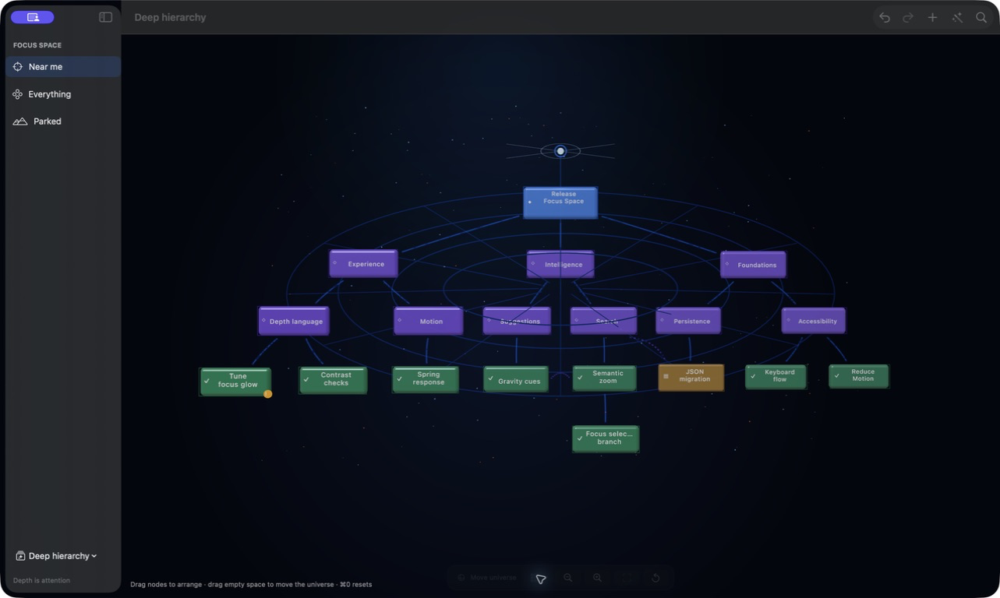

# Interaction refinements — Ibrahim review

This refinement pass responds to Ibrahim's review of selection, relationship persistence, layout, and spatial atmosphere.

## Selection and relationships

An empty-space click now clears selection and closes the inspector. Node clicks remain targeted, so deselection does not compete with selection, rename, or drag gestures.

Selection increases the emphasis of a branch; it no longer determines whether other relationships exist. Unrelated links keep a readable baseline and return to standard emphasis when selection clears. Parked and filtered relationships remain quieter, but are never removed from the scene snapshot.

## Arrange mind map

**Arrange Mind Map** is available in the toolbar, the View menu, and with `Command-Shift-L`. A renderer-independent tidy-tree layout:

- preserves attention and therefore semantic Z
- places parents above descendants
- centres parents over their children
- separates siblings and overlapping cards
- uses a compact grid for a large set of independent thoughts
- frames the complete result in an overview camera pose
- records one Undo step

## Spatial web

The fixed rear-plane guide was replaced with a shallow volumetric web spanning the node attention range. Its nested rings occupy different Z depths and its spokes slope through the universe, so orbiting now reveals it as scene geometry.

The **Universe Web** menu in the compact navigation strip persists one of five opacity settings: Hidden, Barely There, Subtle, Clear, or Strong. Subtle is the default. The renderer clamps the final opacity to a quiet maximum.

The former “FOCUS / YOU ARE HERE” caption has been removed. The small luminous origin remains as an unobtrusive orientation landmark.

## Acceptance

Accepted live on 19 July 2026 in the signed release bundle using the expanded deep hierarchy. Empty-space deselection closed the inspector while preserving every hierarchy path. Arrange separated the full graph, framed all outer leaves, enabled Undo, and left attention unchanged. The web remained visibly three-dimensional during universe movement and responded immediately to every opacity preset.
