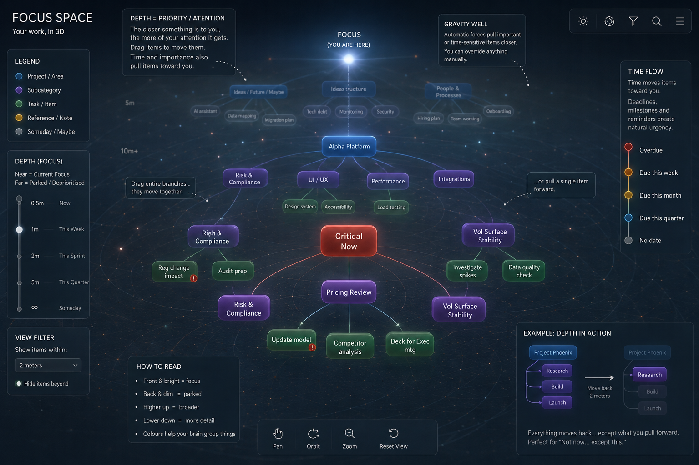
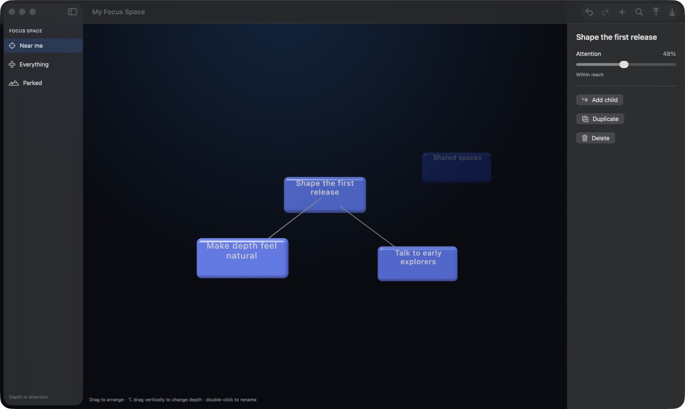
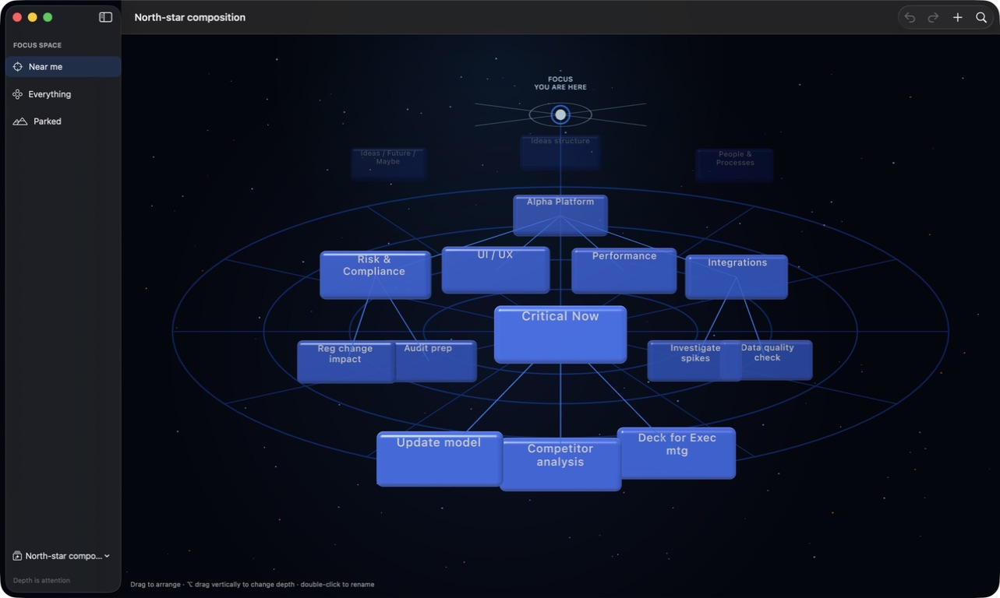

# Milestone 1 — Spatial atmosphere

## Visual contract

The supplied concept is preserved as the visual north star:



The original implementation was captured before renderer work began:



The accepted Milestone 1 north-star composition:



The target is the concept’s sense of calm depth, not its permanently visible explanatory chrome. Legends, depth scales, and gravity/time explanations remain candidates for progressive onboarding in Milestone 7.

## What Milestone 1 changes

- A deterministic, layered star field provides distance texture.
- Elliptical orbital guides and radial spokes reinforce perspective.
- A luminous focus origin establishes a stable “you are here” reference.
- Camera field of view, depth range, key light, fill light, and focus light are tuned as one composition.
- Node scale, solidity, roughness, and emissive response now vary with attention.
- Background particles and guides are combined meshes rather than one entity per mark.
- Atmospheric rotation is slow, deterministic, driven by a native RealityKit animation, and paused by Reduce Motion.
- Renderer reconciliation is snapshot-cached so ambient frames do not rebuild nodes or links.

## Visual tokens

`FocusVisualTokens.midnight` is the single source for:

- deep and mid canvas colours
- cool and warm atmospheric light
- guide, focus, and glass accents
- camera field of view and distance
- semantic near/far Z positions
- ambient revolution duration

The tokens live in the rendering layer. No RealityKit type crosses into the domain or application layers.

## Quality profiles

`SceneQualityProfile` owns three renderer profiles:

| Profile | Stars | Guide segments |
| --- | ---: | ---: |
| Efficient | 48 | 40 |
| Balanced | 96 | 64 |
| Cinematic | 160 | 96 |

Low Power Mode or less than 8 GB of physical memory selects Efficient. Machines with at least 24 GB select Cinematic; other machines select Balanced. All profiles share the same composition and semantic depth mapping.

The atmosphere completes one revolution every six minutes using a native RealityKit animation. SwiftUI and scene reconciliation do no work on ambient frames.

## Deterministic review scenes

The sidebar’s **Experience previews** menu exposes six non-persistent fixtures:

- North-star composition
- Shallow hierarchy
- Deep hierarchy
- Dense map
- Parked work
- Empty space

Previewing a fixture temporarily preserves the personal map in memory. Returning to **Personal space** restores it, and preview changes are never autosaved.

For repeatable launch-time review:

```sh
open ".build/Focus Space.app" --args --demo north-star
```

Other slugs are `shallow`, `deep`, `dense`, `parked`, and `empty`.

## Review checklist

- [x] The focus origin reads as light rather than a solid object.
- [x] The guide field is visible but quieter than nodes and relationships.
- [x] Cool and warm dust provides depth without reading as visual noise.
- [x] Near nodes feel brighter, larger, and more solid than parked nodes.
- [x] The North-star, Dense, Parked, and Empty fixtures remain compositionally coherent.
- [x] Reduce Motion pauses ambient rotation without removing spatial cues (automated renderer test).
- [x] Efficient quality retains the same scene structure with reduced atmospheric geometry (automated renderer test).
- [x] Selection, dragging, depth adjustment, rename, inspector, and undo still work (packaged release app).

The checklist is completed using the packaged app rather than a SwiftUI preview.

Live acceptance was completed on 18 July 2026. Selection exposed the correct inspector at 98% attention; direct drag repositioned the node and enabled undo; Push Back moved it to 86%; and double-click opened rename with the existing title selected. Preview fixtures were launched independently using their deterministic command-line slugs so personal autosave data remained untouched.

## Runtime evidence

All measurements below were taken from ad-hoc signed debug app bundles under the same locked-desktop conditions. They are comparative rather than release-performance targets.

| Build and scene | CPU sample | Resident memory |
| --- | ---: | ---: |
| Original renderer, four-node personal scene | 36% | 132 MB |
| Milestone 1, four-node shallow fixture | 36% | 135 MB |
| Milestone 1, sixteen-node north-star fixture | 49% | 150 MB |

The shallow comparison shows no measurable CPU regression and approximately 3 MB additional resident memory for the atmospheric meshes. The denser fixture adds node/text rendering work as expected while remaining stable. Release profiling on the agreed minimum Mac remains part of Milestone 9.
