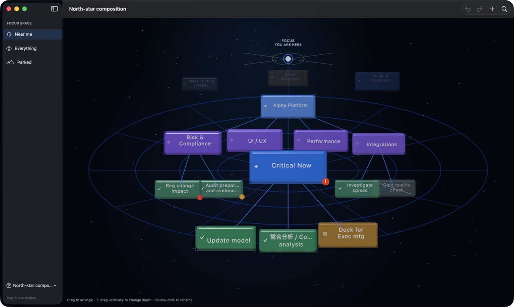

# Milestone 2 — Node visual language

## Purpose

Milestone 2 makes a node’s role and state legible before its title is read. The renderer still consumes an immutable application snapshot; node semantics remain independent of RealityKit.

## Semantic model and migration

`FocusNodeKind` defines five durable domain roles:

| Kind | Silhouette | Glyph | Colour family |
| --- | --- | --- | --- |
| Project / area | broad panel | ◆ | blue |
| Group / subcategory | capsule | ◇ | violet |
| Task / item | compact card | ✓ | green |
| Reference / note | square note | ▤ | amber |
| Someday / maybe | soft ghost capsule | ○ | slate |

The silhouette, proportions, and glyph duplicate the colour signal, so colour is never the only way to identify kind.

The map format is now version 2. Version-1 JSON remains readable: a node without new fields migrates to `task`, `none` urgency, and enabled. The next save emits the explicit version-2 fields in human-readable JSON.

Urgency (`none`, `soon`, or `overdue`) and enabled state are also domain data rather than renderer metadata. They can be changed from the inspector and survive undo, duplication, autosave, and reload.

## Attention and hierarchy

`NodeVisualStyle` is the renderer-owned resolver for kind and state. Increasing attention raises:

- scale through the existing semantic Z treatment
- opacity and solidity
- colour saturation
- edge brightness
- restrained emissive response

Parked nodes retain their silhouette and glyph while becoming quieter. Disabled nodes reduce saturation and solidity, exchange their kind glyph for a dash, and carry a diagonal mark.

The application snapshot calculates hierarchy depth without exposing rendering types. The renderer gives deeper detail a small downward offset while project concepts receive a small upward lift. Authored X/Y placement remains primary.

## Selection and urgency

Selection no longer changes the node’s scale. A quiet cool-white frame appears outside the selected card instead, preserving its spatial position and size.

Due-soon and overdue nodes carry an exclamation badge. Badge shape and symbol preserve the signal independently of amber/red colour.

## Labels

`NodeLabelLayout` normalises whitespace, preserves short titles, uses two balanced lines for longer titles, and truncates after 38 extended grapheme clusters. The layout works on Swift `Character` boundaries, so it does not split Unicode scalar sequences.

The deterministic north-star and dense fixtures include long English, Japanese/English, and Arabic titles. Labels render on an unlit plane just in front of each card for stable contrast, and the reserved glyph margin prevents overlap with the kind cue.

## Review checklist

- [x] All five node kinds have distinct silhouette, proportions, glyph, and colour-family mappings.
- [x] Version-1 JSON loads safely and becomes version 2 without losing node data.
- [x] Attention changes opacity, saturation, edge response, emissive response, scale, and Z.
- [x] Urgency and disabled states remain identifiable without colour.
- [x] Selection uses a halo/frame and does not scale the node.
- [x] Hierarchy depth provides a consistent vertical cue.
- [x] Long, short, Japanese/English, and Arabic fixture labels have deterministic layouts.
- [x] North-star, Dense, expanded Deep, and Parked fixtures accepted in the packaged release app.
- [x] Selection, enabled-state editing, attention, drag, rename, and undo accepted live; kind and urgency state propagation are covered by the renderer/store tests.

Live acceptance was completed on 19 July 2026 using the signed release bundle. The north-star scene demonstrated all five semantic families, urgency badges, a disabled node, long English text, and Japanese/English text. The dense scene retained differentiated depth and state across 32 nodes. The expanded 19-node hierarchy remained readable across four levels, with deliberately staggered leaves. The parked scene kept near, disabled, and someday states distinct and rendered the Arabic title `مراجعة تجربة المستخدم` inside its card.

Selecting **Critical Now** produced an external halo without changing scale and exposed the inspector at 98% attention. Toggling **Active** changed the card to its desaturated dash-and-slash treatment. **Push Back** changed attention from 98% to 86%. Direct drag moved the node and enabled Undo; Undo restored it. Double-click opened rename with the existing title selected.

The expanded hierarchy also serves as the design fixture for Milestone 4 branch framing, orbit, pan, zoom, and canonical-view reset.
