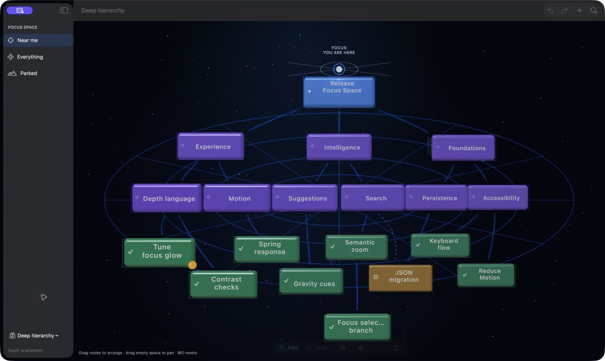

# Milestone 3 — Spatial relationships

## Purpose

Milestone 3 turns relationships into spatial structure rather than metadata drawn as straight lines. The renderer consumes explicit relationship snapshots; RealityKit remains an implementation detail.

Solid blue curves show parent–child hierarchy. Dashed purple curves are cross-links: they mean two thoughts are related without making either one the parent. Select a thought and use **Related thoughts → Add relationship** in the inspector to create one; the same section can navigate to or remove existing cross-links.

## Relationship contract

`FocusSceneSnapshot.Relationship` describes hierarchy and cross-links with stable endpoint IDs, average attention, filter state, and semantic emphasis. The application derives that contract from `FocusMap`, de-duplicates reciprocal cross-links, and never exposes RealityKit types.

Selection or hover creates four calm context levels:

- direct: the focused node, its ancestry, and links touching it
- branch: descendants, siblings, and the nearby family
- subdued: unrelated structure that should remain locatable
- standard: the quiet default before a context is chosen

Hover temporarily previews a branch without changing the durable selection.

## Geometry and visual grammar

`RelationshipCurveGeometry` is a pure, testable cubic Bézier resolver. It clips both endpoints to the node silhouettes so paths do not enter card bodies. Hierarchy paths use a restrained depth lift and a continuous blue core; cross-links use a lateral arch, violet core, and alternating segments.

Each rendered path has a thin core and a broad, low-opacity glow. Attention, current filters, and contextual emphasis jointly control opacity and thickness. Parked links therefore recede without being deleted, and unrelated lines remain available as faint orientation cues.

## Review checklist

- [x] Curved hierarchy paths end at node silhouettes.
- [x] Cross-links are visibly distinct without relying on colour alone.
- [x] Selection emphasises ancestry and immediate family.
- [x] Hover uses the same branch-preview contract and restores selection context on exit.
- [x] Filtered and parked relationships recede rather than disappear.
- [x] Efficient and higher quality profiles adjust curve sampling.
- [x] Deep and dense deterministic fixtures remain navigable.
- [x] Pure geometry, relationship derivation, de-duplication, context, and renderer output are covered by tests.

Live acceptance was completed on 19 July 2026 using the signed bundle and expanded deep-hierarchy fixture. The four-level structure remained legible; solid hierarchy and dashed cross-links remained distinct; selected ancestry brightened while unrelated branches stayed visible.
