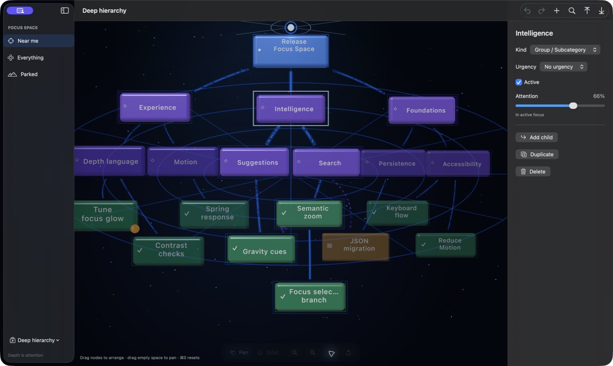
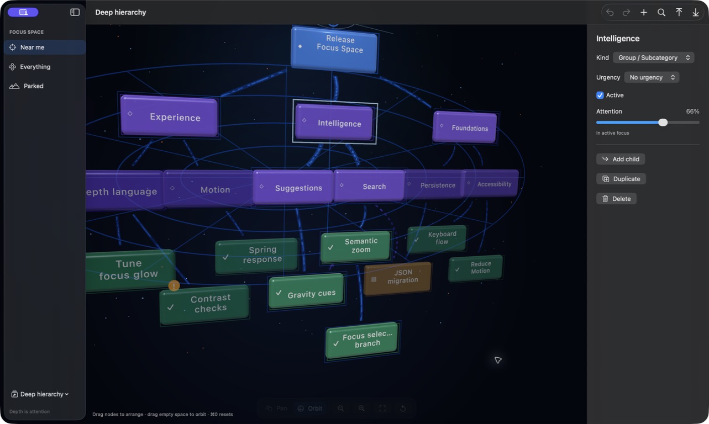

# Milestone 4 — Camera navigation

## Purpose

Milestone 4 lets the user move around the universe without changing what depth means. Pan, orbit, zoom, and framing operate on a renderer-independent camera intent; node attention remains untouched.

## Semantic camera intent

`FocusCameraIntent` describes a target in authored X/Y plus semantic attention, restrained yaw and pitch, camera distance, transition intent, and one of three modes: canonical, free, or framed branch. The RealityKit adapter alone converts semantic attention into world Z.

Every pose is bounded to preserve orientation: target travel, orbit angles, and zoom distance have soft workspace limits. Camera updates carry a revision so a new gesture interrupts an in-flight programmatic transition cleanly.

## Interaction model

- Drag empty space in any direction to move the universe and inspect physical depth. Horizontal and vertical motion are one direct interaction rather than separate pan/orbit modes.
- Pinch or use the compact controls to zoom.
- Select any node and choose **Frame Branch** (`Command-Shift-F`) to centre it and its descendants regardless of attention.
- Press `Command-0` from anywhere to animate back to the canonical attention view.
- Use `Command-=` / `Command--` for zoom and `Option` plus arrow keys to move the universe.

The bottom control strip fades after four seconds and returns on interaction. A free camera gently returns after 45 idle seconds only when nothing is selected or being edited. A framed branch never recentres itself. Reduce Motion changes programmatic moves to immediate transforms and pauses ambient orbit.

Node dragging and universe dragging are exclusive gestures, so camera navigation cannot accidentally move a node. The active node and camera receive immediate transforms during a gesture, while reconciliation updates only changed visuals and relationship meshes. Framing and every camera operation leave `FocusMap` unchanged; this is enforced by tests.

## Review checklist

- [x] Renderer-independent camera target and pose contract.
- [x] Unified mouse/trackpad universe movement, rotation, and magnification.
- [x] Branch framing across X/Y and semantic Z without attention mutation.
- [x] Animated, interruption-safe programmatic transitions.
- [x] Predictable `Command-0` recovery.
- [x] Bounded camera motion and zoom.
- [x] Minimal auto-hiding controls and keyboard equivalents.
- [x] Reduce Motion and safe idle-return behaviour.
- [x] Pure bounds, store invariants, framing, and renderer consumption covered by tests.

Live acceptance was completed on 19 July 2026 using the signed bundle. **Intelligence** and its descendants framed correctly, an empty-space orbit exposed the card planes and Z separation, and `Command-0` restored the canonical view. The inspector continued to report 66% attention throughout the camera-only interactions.
